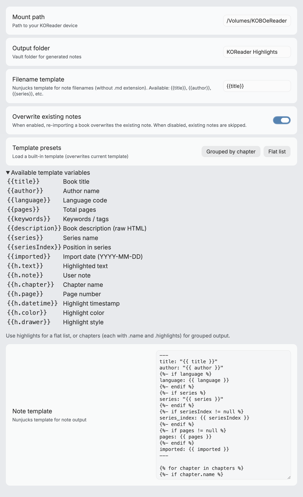

# KOHi — KOReader Highlights for Obsidian

Import highlights and notes from [KOReader](https://koreader.rocks/) into your [Obsidian](https://obsidian.md/) vault.

KOHi scans your KOReader device for `.sdr` metadata directories, parses the Lua-serialized annotations, and generates one Markdown note per book — with full control over the output format via Nunjucks templates.



## Features

- **Auto-detect all 3 KOReader storage modes** — book folder, `koreader/docsettings`, and `koreader/hashdocsettings`
- **Customizable templates** — Nunjucks-based templates with access to book metadata, highlights, and chapter grouping
- **Selective import** — import all books at once, or pick specific ones via fuzzy search
- **Clean filenames** — illegal characters are sanitized automatically
- **Overwrite on re-import** — simple, predictable behavior

## Usage

1. Connect your Kobo (or other KOReader device) via USB
2. Open Obsidian → Settings → KOHi → set **Mount path** (e.g. `/Volumes/KOBOeReader`)
3. Command Palette → **KOHi: Import all highlights** or **KOHi: Import selected highlights**
4. Notes appear in your configured output folder

## Settings

| Setting | Description | Default |
|---|---|---|
| Mount path | Absolute path to your mounted KOReader device | — |
| Output folder | Vault folder for generated notes | `KOReader Highlights` |
| Filename template | Nunjucks template for note filenames (e.g. `{{author}} - {{title}}`) | `{{title}}` |
| Overwrite existing | Whether to overwrite notes on re-import or skip them | On |
| Note template | Nunjucks template for note output | See below |

## Template

Notes are generated using [Nunjucks](https://mozilla.github.io/nunjucks/) templates. You can customize the output format in plugin settings.

### Available variables

**Book level:**

| Variable | Description |
|---|---|
| `{{title}}` | Book title |
| `{{author}}` | Author name |
| `{{language}}` | Language code |
| `{{pages}}` | Total pages |
| `{{keywords}}` | Keywords / tags |
| `{{description}}` | Book description (raw HTML from EPUB) |
| `{{series}}` | Series name |
| `{{seriesIndex}}` | Position in series |
| `{{imported}}` | Import date |

**Highlight level** (within loops):

| Variable | Description |
|---|---|
| `{{h.text}}` | Highlighted text |
| `{{h.note}}` | User note (if any) |
| `{{h.chapter}}` | Chapter name |
| `{{h.page}}` | Page number |
| `{{h.datetime}}` | Highlight timestamp |
| `{{h.color}}` | Highlight color (e.g. `yellow`, `green`, `red`) |
| `{{h.drawer}}` | Highlight style (`lighten`, `underscore`, `strikeout`, `invert`) |

Two data structures are provided for flexibility:

- `highlights` — flat array, original reading order
- `chapters` — grouped by chapter, each with a `name` and `highlights` array

### Default template

```nunjucks
---
title: "{{title}}"
author: "{{author}}"
language: {{language}}
series: "{{series}}"
series_index: {{seriesIndex}}
pages: {{pages}}
imported: {{imported}}
---

{{description}}

---



## {{chapter.name}}


> {{h.text}}

>
> — p.{{h.page}}



> [!note]
> {{h.note}}




```

### Flat list (no chapter grouping)

```nunjucks
---
title: "{{title}}"
author: "{{author}}"
series: "{{series}}"
series_index: {{seriesIndex}}
imported: {{imported}}
---

{{description}}

---


> {{h.text}}

>
> — p.{{h.page}}



> [!note]
> {{h.note}}



```

## Installation

### From community plugins (coming soon)

1. Open Obsidian → Settings → Community plugins → Browse
2. Search for **KOHi**
3. Click Install, then Enable

### Via BRAT

1. Install the [BRAT](https://github.com/TfTHacker/obsidian42-brat) plugin
2. BRAT settings → **Add Beta Plugin** → paste `chiahsien/obsidian-kohi`

### Manual install

1. Download `main.js` and `manifest.json` from the [latest release](https://github.com/chiahsien/obsidian-kohi/releases)
2. Create a folder `<vault>/.obsidian/plugins/kohi/`
3. Copy the downloaded files into that folder
4. Restart Obsidian → Settings → Community plugins → Enable **KOHi**

### Build from source

```sh
git clone https://github.com/chiahsien/obsidian-kohi.git
cd obsidian-kohi
npm install
npm run build
```

Then copy `main.js` and `manifest.json` into your vault's plugin folder as described above.

## Development

### Prerequisites

- Obsidian ≥ 1.7.2
- Node.js ≥ 18
- npm

### Setup

```sh
git clone https://github.com/chiahsien/obsidian-kohi.git
cd obsidian-kohi
npm install
```

### Commands

| Command | Description |
|---|---|
| `npm run dev` | Start esbuild in watch mode |
| `npm run build` | Type-check + production build |
| `npm test` | Run tests once |
| `npm run test:watch` | Run tests in watch mode |

### Project structure

```
src/
├── types.ts              # Shared interfaces (Book, Highlight, BookData, etc.)
├── lua-parser.ts         # Recursive descent parser for KOReader Lua metadata
├── scanner.ts            # Three-phase .sdr directory scanner
├── book-parser.ts        # Metadata → BookData extraction + chapter grouping
├── note-generator.ts     # Nunjucks template rendering
├── note-writer.ts        # Vault file creation with filename sanitization
├── multi-select-modal.ts # Fuzzy-search book picker modal
├── settings.ts           # Plugin settings tab
└── main.ts               # Plugin entry point + commands
```

### Hot-reload during development

1. Build with `npm run dev` (watch mode)
2. Symlink or copy the repo into your test vault:
   ```sh
   ln -s /path/to/obsidian-kohi /path/to/vault/.obsidian/plugins/kohi
   ```
3. Enable the plugin in Obsidian → changes are picked up on reload (Cmd+R)

## License

MIT

<a href="https://www.buymeacoffee.com/chiahsien" target="_blank"></a>
